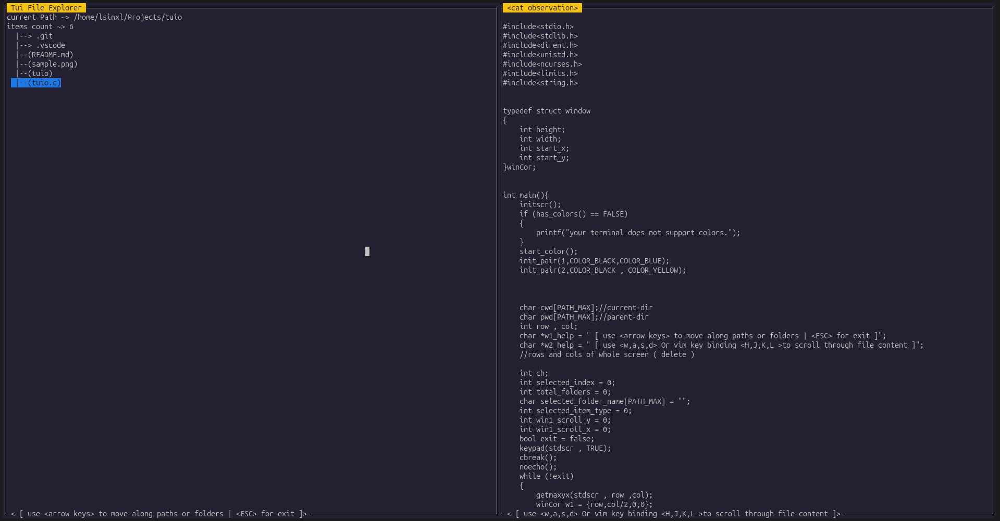

# TUIO - Terminal File Explorer

TUIO is a simple **Terminal User Interface (TUI) file explorer** written in **C** using the **ncurses** library.  
It allows users to navigate directories and preview file contents directly from the terminal.

The interface is split into two windows:

- **Left window** → Directory navigation
- **Right window** → File content preview

This project is a minimal example of building a **terminal-based file manager** with keyboard navigation.

---



---

## Features

- Navigate directories using arrow keys
- Open folders and move to parent directory
- Preview readable text files
- Detect binary files and prevent unreadable output
- Scroll vertically and horizontally through file content using VIM key bindings
- Simple ncurses-based UI with two panels

---
## Requirements

- Linux / Unix-like OS
- GCC compiler
- `ncurses` library

---
## Install dependencies ( for macOS and Unix-like OS)
!! It may have some Problems. In the case of any error please open issues !!
```
chmod +x ./install.sh && ./install.sh
```
---

## Installing ncurses (For debian based OS)

```bash
sudo apt install libncurses5-dev libncursesw5-dev
```

---

## compilation (for any additional self-customization)

```
gcc tuio.c -o tuio -lncurses
```
---
## running
```
./tuio
```

